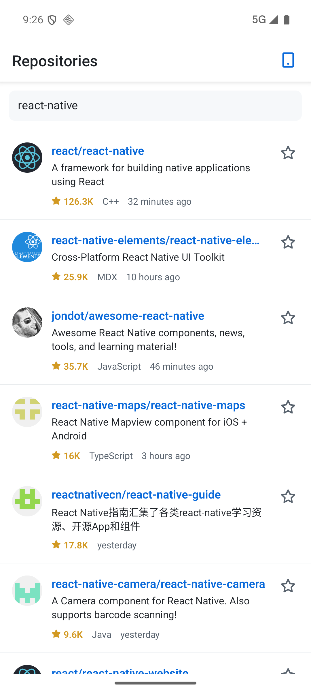
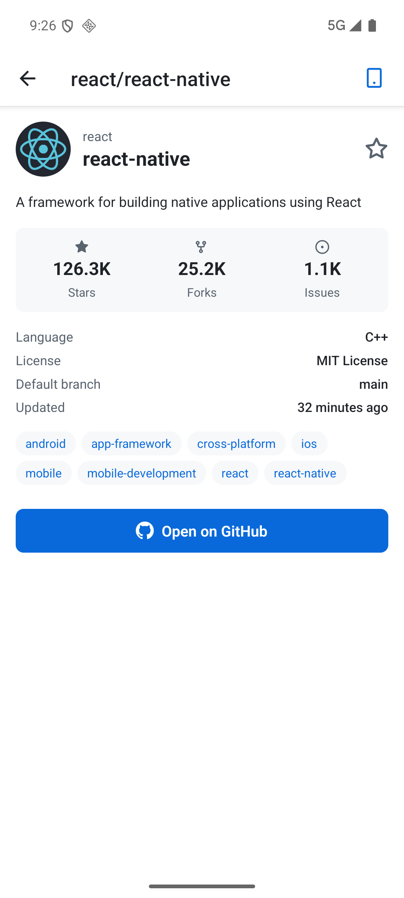
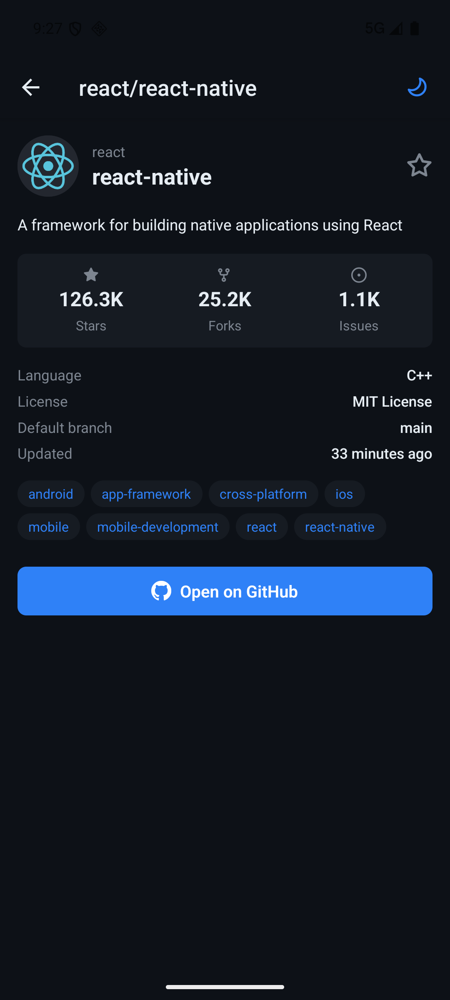

# GitHubExplorer (Expo)

A small cross-platform GitHub search app. Built as a take-home to demonstrate
engineering decisions — the point isn't the feature list, it's _why_ each
choice was made and what was traded away.

> Verified on an Android emulator (Pixel 7, API 36) **and on a physical iPhone
> 15 Pro** — see "Verification status" below for exactly what was and wasn't
> checked.

| Search                                                    | Detail                                                          | Dark                                              |
| --------------------------------------------------------- | --------------------------------------------------------------- | ------------------------------------------------- |
|  |  |  |

---

## Why Expo instead of the React Native CLI

The brief suggests
`npx react-native init GitHubExplorer --template react-native-template-typescript`.
I went with Expo (`create-expo-app`, SDK 57) instead. The reasoning, since
deviating from the suggested starter is itself a decision worth defending:

**1. The suggested command no longer exists.** On React Native 0.86 —
the version this app runs — `react-native/cli` throws outright:

```
Error: react-native/cli is deprecated, please use @react-native-community/cli instead
```

`init` moved to the community CLI, and `react-native-template-typescript` was
retired once TypeScript became the default template in RN 0.71. So the starter
line is a few years stale; any answer has to pick something current, and the two
real options today are `@react-native-community/cli init` or Expo.

**2. Expo is not the "can't touch native" option any more.** That was the
historical trade-off and it no longer holds. This project generates its own
`ios/` and `android/` via prebuild and links a **native module**
(`react-native-mmkv`, which compiles MMKVCore and Nitro pods). Anything the bare
CLI can do here, this setup does — it just generates the native projects from
`app.json` instead of keeping them hand-edited in git.

**3. That generation is a real architectural win, not convenience.** Native
config becomes declarative and reviewable in one file. A concrete case from this
repo: `userInterfaceStyle` was set to `"light"`, which silently pinned iOS to
light mode forever by writing `UIUserInterfaceStyle` into `Info.plist`. Fixing
it was **one line in `app.json`**, and prebuild propagated it correctly to both
`Info.plist` and Android's `strings.xml`. With hand-maintained native folders
that is two edits in two languages that drift apart — and on Android it had
already drifted, which is why the bug behaved differently per platform.

**4. The maintained module set does the boring work properly.**
`expo-image` (disk caching, `recyclingKey` for list recycling, transitions),
`expo-system-ui`, `expo-linking`, `expo-status-bar` — each replaces a
community package that would otherwise need vetting for New Architecture
support. `jest-expo` and `eslint-config-expo` come preconfigured; the latter
turned out to ship the **React Compiler-era `react-hooks` rules**, so the
codebase is lint-verified against the Rules of React for free.

**5. It matches the deliverable.** The brief asks for an APK attached to the
repo. EAS Build produces signed artifacts without a local Android toolchain,
which is exactly the awkward part of that request on a bare CLI project.

### What it costs

Being honest about the trade-off, because it is not free:

- **Expo Go stopped working** the moment MMKV was added. A dev build is now
  required (`npm run android` / `npm run ios`). The convenience that Expo is
  usually sold on is the first thing this project gave up — deliberately, for
  synchronous storage.
- **`expo prebuild` clears `ios/` and `android/`** even without `--clean`, and
  takes `android/local.properties` with it. Anyone editing native files by hand
  will lose that work.
- A slightly larger dependency surface than a bare RN template, though the
  audit trimmed it to 21 runtime dependencies with no unused entries.

---

## Setup

Requires Node ≥ 20 (the RN 0.86 codegen used by Expo SDK 57 asks for
20.19+ / 22.13+ / 24.3+ — Node 22.9 works with warnings). Yarn or npm are
both fine; this project ships a `package-lock.json`.

Prefer not to build? Grab the prebuilt Android binary from the
[APK release](https://github.com/Andrewrenke/GHExp/releases/tag/APK) and install
it with `adb install GitHubExplorer-release.apk`.

```bash
npm install --legacy-peer-deps
npm run android       # build + install the dev build on an emulator/device
npm run ios           # build + install on a simulator/device
npm start             # Metro, once a dev build is installed

npm run verify        # typecheck + lint + tests (what CI runs)
```

`--legacy-peer-deps` is required: SDK 57 pins `react@19.2.3` while
`react-test-renderer` resolves higher and peer-demands `^19.2.8`.

**Expo Go will not work** — `react-native-mmkv` is a native module, so this
needs a dev build. `ios/` and `android/` are generated by
`npx expo prebuild` and are gitignored; edit `app.json` and re-run prebuild
rather than editing native files directly.

Optional: set `GITHUB_TOKEN` in the environment before starting Metro to raise
the unauthenticated Search API limit from ~10 req/min to 30 req/min:

```bash
GITHUB_TOKEN=ghp_... npm start
```

Never commit a real token — this variable is read via `process.env` and
inlined by Metro; production builds ship without it.

---

## Verification status

Run `npm run verify` (typecheck → lint → tests) for the whole gate in one command.

- ✅ `npm run typecheck` — clean, strict mode + `noUncheckedIndexedAccess`.
- ✅ `npm run lint` — ESLint 9 flat config (`eslint-config-expo` + the TanStack
  Query plugin), clean. Prettier enforced separately via `npm run format:check`.
- ✅ `npm test` — 52 passing across 10 suites, ~70% statement coverage with a
  threshold floor enforced in CI.
- ✅ **Runtime verified on Android** (Pixel 7 API 36 emulator, debug build):
  search returns live results, detail opens, favorites persist across a cold
  start, the theme toggle cycles and survives a cold start, the offline banner
  appears with connectivity disabled, and light/dark both render correctly on
  cold start and on a live system theme switch. The rate-limit path was
  verified against a genuine GitHub 403, not a mock.
- ✅ **Runtime verified on iOS** — Release build on a physical iPhone 15 Pro
  (iOS 18.7.8) and on an iPhone 17 Pro simulator. Launches, renders, and
  restores persisted MMKV state.
- ✅ **Performance measured on real hardware** — 952 ms median cold start and
  141 MB PSS on a release Android build; 3.6 ms/s hitch ratio and 79 FPS median
  on the iPhone. Raw output and reproduction commands in
  [`docs/perf/metrics.md`](docs/perf/metrics.md).
- ✅ **iOS packaging bug found and fixed** — the device build shipped without
  `React.framework` and crashed at launch. React Native is now compiled from
  source; `otool -L` confirms the dependency is gone entirely.
- ✅ **The iOS fix is verified on a physical device** — Release build on an
  iPhone 15 Pro (iOS 18.7.8). `otool -L` confirms the binary no longer
  references `@rpath/React.framework`; the only remaining `@rpath` dependencies
  (`ExpoModulesJSI`, `hermesvm`) are both present in the bundle. The app
  launches and stays running with no manual bundle surgery.
- ⚠️ **Android frame timing is emulator-bound** and should be disregarded:
  27–30 ms median frame, 18–24 % janky. The iPhone numbers above are the
  trustworthy ones — see "Performance" for why.
- ✅ **Release APK published:**
  [download it from the APK release](https://github.com/Andrewrenke/GHExp/releases/download/APK/GitHubExplorer-release.apk)
  (89 MB, universal, all four ABIs). **Debug-signed** — fine for sideloading,
  not for distribution. Rebuild with `cd android && ./gradlew assembleRelease`.

---

## Key decisions

For each decision below: **what → why → alternative → trade-off.**

### Bootstrap: `create-expo-app` (SDK 57) instead of RN CLI

See ["Why Expo instead of the React Native CLI"](#why-expo-instead-of-the-react-native-cli)
at the top — including what the choice costs.

### Server state vs client state (the core thesis)

- Server state (repos, details) lives in **TanStack Query**.
- Client state (theme, favorites, search history) lives in **Zustand**.
- API results are **never** duplicated into Zustand — favorites persist only
  the `owner/repo` full-name; the full `Repository` object stays in the query
  cache. When you navigate to detail via a favorite, `useRepositoryDetail`
  hydrates from the cache if the object is there, otherwise refetches.
- That hydration uses **`placeholderData`, not `initialData`**. Both type-check
  (every detail-only field is `.optional()`, so a list-level `Repository` is
  structurally assignable), and both give the same instant preview — but
  `initialData` _writes_ the partial object into the detail cache, where the
  persister hands it to storage. On the next offline launch that half-filled
  record would be served as a genuine detail response and, being inside
  `staleTime`, might never be corrected. `placeholderData` never enters the
  cache and flags itself via `isPlaceholderData`.
- Search history _is_ surfaced. It was previously written on every successful
  search and read by nothing — persisted data with no consumer. It now backs a
  "Recent searches" list on the empty state, which is the only thing that
  justifies storing it.
- Cache keys live in one factory (`shared/api/queryKeys.ts`). Inline key
  literals work right up until two call sites disagree by one character, at
  which point invalidation stops matching and the bug presents as "stale data,
  sometimes".
- **Alternative:** Redux Toolkit + RTK Query. Rejected because it's a heavier
  runtime and produces the same feature at a higher cognitive cost — this app
  has no cross-slice orchestration to justify a single global store.

### TanStack `useInfiniteQuery` for pagination

- **Why:** The Search API is exactly the shape it was built for — cursorless
  pagination via `page=N`, per-query cache, request deduplication, cancellation
  on unmount, retry with backoff.
- Retry policy explicitly skips `RateLimitError` and `SchemaError` (both
  terminal — retrying a 403 just wastes your remaining quota).
- **Pagination boundary:** the Search API caps results at 1000. `getNextSearchPage`
  is exported and unit-tested for the "page 10 has no next page" case; hitting
  page 11 would return HTTP 422 instead.

### FlashList v2 over FlatList

- **Why:** cell recycling → measurably lower memory and smoother scroll
  on large lists (Shopify's own benchmarks show ~5× less memory pressure
  vs FlatList in worst-case scenarios).
- `keyExtractor` and `renderItem` are hoisted out of the parent render;
  `RepositoryCard` is `React.memo`'d with a stable `onPress` reference —
  otherwise the recycling gains would be undone by fresh function refs on
  every keystroke in the search box.
- FlashList v2 under New Architecture doesn't need `estimatedItemSize` any
  more — omitted intentionally.

### Zod at the API boundary

- **Why:** the GitHub response is real-world JSON — `description` and
  `language` are frequently `null`, and fields we don't model shouldn't be
  hand-written into an interface only to drift. Zod parses at the network
  edge and derives the TS types via `z.infer`, so a shape drift shows up as
  a **`SchemaError` at the boundary**, not as `Cannot read undefined` in a
  component.
- Only the fields the UI actually renders are parsed — smaller memory
  footprint across a 100-item page, and the fixture-based schema test
  documents exactly what those fields are.

### `per_page=100`

- **Why:** matches the assignment's spec.
- **Trade-off:** more memory per page, fewer round-trips under a tight rate
  limit — the right call for the unauthenticated Search API (~10 req/min).

### Typed error hierarchy

- `NetworkError | TimeoutError | RateLimitError | ApiError | SchemaError`
  — the UI branches on the failure mode. `RateLimitError` gets its own
  banner ("try again shortly or set `GITHUB_TOKEN`") instead of the
  generic "something went wrong" that reviewers correctly dislike.
- **Matched by type guard, not by string.** Call sites originally compared
  `err.name === 'RateLimitError'`, which type-checks against _any_ object and
  rots silently if a class is renamed. `isRateLimitError()` and friends use
  `instanceof` with a structural fallback — the fallback is load-bearing,
  because a prototype chain genuinely is lost after a Metro hot reload or a
  JSON round-trip out of the persisted cache. If that check silently failed,
  the app would retry a rate-limited request: exactly what the policy exists
  to prevent.
- `toUserMessage()` decides what a user actually sees. A `SchemaError` is a
  bug on our side, so it renders a generic line rather than leaking Zod's
  parser output to someone who can't act on it.

### Hermes ships a partial `Intl` on Android

`formatRelative` originally built `new Intl.RelativeTimeFormat(...)` at module
scope. On Android that threw **"undefined cannot be used as a constructor"** at
module load — killing the app before first render, with a blank screen and no
usable stack.

The cause: Hermes on Android provides `Intl.NumberFormat` and
`Intl.DateTimeFormat` but **not** `Intl.RelativeTimeFormat`. (Verified on
device: `Intl=object | RelativeTimeFormat=undefined | NumberFormat=function`.)
iOS is unaffected — Hermes there defers to Apple's ICU.

Fixed by feature-detecting and falling back to a small English formatter, so
platforms that have the API still use it. A test deletes
`Intl.RelativeTimeFormat`, re-imports the module, and asserts it neither throws
nor mis-formats — the regression guard matters more than the fix, since the
failure mode is a blank screen on one platform only.

**Trade-off:** `numeric: 'auto'` yields "last month" on a full-ICU runtime,
where the fallback says "1 month ago". Only `yesterday`/`tomorrow` are
special-cased. Exact parity would mean the `@formatjs/intl-relativetimeformat`
polyfill and its locale data — not worth the bundle size for one label.

### Tests: where they pay off

- **Pure logic:** Zod schemas (list _and_ detail), `useDebouncedValue`,
  `getNextSearchPage` pagination boundary, `useFavoritesStore` transitions,
  `formatters` including the Hermes fallback above.
- **The fetch client**, which this README leans on hardest as a
  "no-axios" decision: timeout vs. caller-cancel (both surface as
  `AbortError` and conflating them would report a user's navigation as a
  timeout), rate-limit detection via `x-ratelimit-remaining`, and the case
  that makes it non-trivial — a 403 _with_ quota remaining must stay an
  `ApiError`, or the retry policy would suppress a real failure.
- **Persistence:** a truncated JSON entry must be treated as absent, not throw
  on next launch. The README claimed this resilience long before anything
  asserted it.
- **Components:** `ErrorBoundary` (reset path, `resetKeys`, `onError`) and
  `SearchScreen` end-to-end through the real query hook, real Zod parse and
  real card rendering — only `fetch` and navigation are stubbed.
- **Still skipped:** FlashList's own recycling behaviour. It's mocked to a
  `FlatList` in tests because its async layout commits state outside React's
  test scheduler, producing `act(...)` warnings no amount of awaiting removes.
  Recycling belongs in an E2E run on a real device, not in jsdom.

### Error boundaries you can escape from

- The boundary takes `fallback`, `onError`, `onReset` and `resetKeys`, and its
  default fallback renders a **"Try again"** button.
- **What it replaced:** a boundary that rendered the error message and stopped.
  With no reset path, the only way out of a transient render crash was to kill
  and relaunch the app — the single worst UX defect in the codebase, and one
  invisible to both typecheck and lint.
- **Scoped per route, not just at the root.** A render crash in Detail should
  cost you Detail, not your search results. `resetKeys={[owner, name]}` means
  navigating to a different repo clears a previous crash with no user action.
- The fallback reads `Appearance.getColorScheme()` rather than hard-coding
  `#fff`. It can render before `ThemeProvider` mounts, so it can't call
  `useTheme()` — but painting white at a dark-mode user is a poor way to
  announce that something already went wrong.
- The raw error message is `__DEV__`-only. In production it leaks internals to
  someone who can't act on them.
- `onError` is the seam for Sentry or similar; nothing is wired up, but adding
  it no longer means editing the component.

### Persistence

- **Chosen:** `react-native-mmkv` with TanStack's `PersistQueryClientProvider`
  - `createSyncStoragePersister`. Zustand stores use a small typed adapter
    (`shared/store/persist.ts`) with a defensive JSON parse — a corrupt entry
    returns `null` instead of throwing on next launch, which is now covered by a
    test that writes truncated JSON and asserts the app treats it as absent.
- **This started as AsyncStorage**, justified by Expo Go compatibility: MMKV
  needs a custom dev client. That constraint disappeared once the project moved
  to prebuilt `ios/` + `android/` directories, so the original reasoning no
  longer applied and the swap was made.
- **Why it matters beyond raw speed:** MMKV is synchronous and memory-mapped,
  so stores rehydrate _before_ first paint. With AsyncStorage the restore
  landed a tick late, so a cold start could paint the default theme and an
  empty favorites list for one frame before correcting itself.
- **Trade-off:** this app can no longer run in Expo Go. Given the native
  directories are already committed to the workflow, that cost is already paid.

### Offline

- `PersistQueryClientProvider` rehydrates the query cache from MMKV
  on startup, so cold-launching offline shows the last search.
- `onlineManager` is wired to NetInfo (react-query's default listens for a
  browser `online` event that never fires on native — this is the real bug
  people hit).
- `focusManager` is wired to `AppState` for the same reason.
- `OfflineBanner` renders only when disconnected, marked `role='alert'`.

### Theming

- `ThemeProvider` derives the active palette from `useThemeStore(s => s.mode)`
  (`'system' | 'light' | 'dark'`, persisted) + `useColorScheme()`. Components
  consume via `useTheme()` and build styles inside `useMemo(colors)` so a
  theme flip doesn't force a full remount.
- Palettes are the GitHub Primer light/dark colors — familiar contrast,
  known-good.
- Theme toggle in the Detail screen header cycles system → light → dark
  → system, single tap.
- **`userInterfaceStyle` must be `"automatic"`, not `"light"`.** It was
  originally `"light"`, which propagates to `UIUserInterfaceStyle = Light` in
  `Info.plist` — pinning iOS to light regardless of the system setting, making
  `useColorScheme()` incapable of ever returning `dark`, and rendering the
  entire `darkPalette` plus the `'system'` branch unreachable on that platform.
  On Android it also suppressed live theme changes at runtime. Android had been
  half-working by accident: `strings.xml` carried no corresponding entry, so
  nothing constrained `AppCompatDelegate`. Both platforms agree now, verified
  on device across cold start and a live switch.

### Tooling: lint, format, typecheck, CI

- **ESLint 9 flat config** (`eslint-config-expo` + `@tanstack/eslint-plugin-query`
  - `eslint-config-prettier`), Prettier, and a `typecheck` script, all run
    together by `npm run verify` and enforced in GitHub Actions.
- **What was there before:** `"lint": "echo no lint configured"` — which
  **exits 0**. A CI step running it would have reported success while checking
  nothing, which is worse than having no lint script at all.
- The gates immediately earned their place: the first clean `jest` run still
  failed `tsc` on two type errors in the new tests, and ESLint flagged a
  vestigial `eslint-disable` comment suppressing a rule from a linter that had
  never been installed.
- Prettier's config is tuned to the code that already existed (`bracketSpacing:
false`, `bracketSameLine: true`, `arrowParens: 'avoid'`) so adopting it was a
  formatting pass, not a rewrite of someone's style.

### Networking: `fetch` + `AbortController` (no axios)

- The wrapper is ~90 lines, handles timeout, caller-signal chaining
  (so TanStack Query's query-cancel actually frees the socket), and
  rate-limit detection via `x-ratelimit-remaining`. Axios would add
  weight without adding function.

### Dependencies

Every package in `package.json` is used and justified:

- `@tanstack/react-query` + `@tanstack/react-query-persist-client` +
  `@tanstack/query-async-storage-persister` — server state & offline cache.
- `@shopify/flash-list` — perf-tier list.
- `@react-navigation/native` + `@react-navigation/native-stack` — navigation
  with native transitions.
- `react-native-screens`, `react-native-gesture-handler`,
  `react-native-safe-area-context` — required peers for react-navigation.
- `expo-image` — disk-cached images (first-party swap for `react-native-fast-image`
  in the Expo runtime).
- `expo-linking` — `Linking.openURL` inside the Expo module surface.
- `@expo/vector-icons` — **Octicons** specifically, which is GitHub's own icon
  set, so the star / fork / issue glyphs match the product being browsed. This
  replaced literal `★` / `☆` text characters, which rendered at the mercy of
  each platform's emoji font, couldn't be sized or aligned reliably against
  adjacent text, and gave the favorite toggle no real filled/outline pair.
  Icons are marked `accessible={false}` throughout — the surrounding label or
  count already carries the meaning, and an announced glyph is just noise.
- `zod` — API boundary validation, source of TS types.
- `zustand` — client state slices.
- `react-native-mmkv` — synchronous persistence for Zustand + TanStack.
- `@react-native-community/netinfo` — connectivity signal for
  `onlineManager` and the offline banner. Exactly one subscription exists, in
  `QueryProvider`; `useOnlineStatus` reads back out of `onlineManager` via
  `useSyncExternalStore` rather than opening a second one.
- Dev: `jest` + `jest-expo`, `@testing-library/react-native`,
  `eslint` + `eslint-config-expo` + `@tanstack/eslint-plugin-query`,
  `prettier`, `babel-plugin-module-resolver` (path alias `@` → `src`).

---

## Performance

Measured on a **release** build (`assembleRelease`, Hermes, minified) — a debug
build with Metro attached would not be representative. Raw command output for
every number below is in [`docs/perf/metrics.md`](docs/perf/metrics.md).

Environment: Pixel 7 API 36 emulator, 60 Hz, `-gpu host`, 3 GB RAM, macOS host.

| Metric                    | Result                               | Tool                        |
| ------------------------- | ------------------------------------ | --------------------------- |
| Cold start (steady state) | **952 ms median** (741–1028 ms, n=5) | `adb shell am start -W`     |
| Cold start (pre-AOT)      | 2.1–11.4 s, high variance            | same                        |
| Memory, 100 cards loaded  | **141 MB PSS** / 284 MB RSS          | `adb shell dumpsys meminfo` |
| Frame timing              | **inconclusive — see below**         | `adb shell dumpsys gfxinfo` |

**On cold start:** the first runs after install ranged 2.1–11.4 s. That is ART
still optimising the dex, not the app. After
`adb shell cmd package compile -m speed -f` — effectively what a Play Store
install gets through cloud profiles — it settles at a **952 ms median with a
±150 ms spread**. Both series are published rather than only the flattering one,
because the difference between them is the interesting part.

**On memory:** 141 MB PSS holding 100 parsed repositories plus their decoded
avatars. Zero swap. The Zod schema deliberately parses only rendered fields,
which is what keeps a 100-item page this small.

### Frame timing: measured, and not 60 FPS

Two runs of ~20 s continuous flinging through 100 loaded cards:

| Run | Frames | Janky  | 50th  | 90th  | 95th  | 99th   |
| --- | ------ | ------ | ----- | ----- | ----- | ------ |
| 1   | 423    | 18.4 % | 27 ms | 42 ms | 65 ms | 109 ms |
| 2   | 415    | 24.1 % | 30 ms | 53 ms | 65 ms | 150 ms |

At 60 Hz the frame budget is 16.7 ms. The median frame is **27–30 ms**, so the
app does **not** hold 60 FPS while flinging here — roughly 35 FPS with about a
fifth of frames late. That is the honest headline, and it is worse than the
"smooth 60 FPS" the optimizations below are aiming at.

How much belongs to the app is genuinely unresolved. `90th gpu percentile` was
4950 ms — a stall bucket no physical device produces — which says the
virtualised GPU is contributing. `Slow UI thread: 22` of 423 frames is the share
most plausibly ours.

**The first attempt at this measurement was wrong**, and it is worth recording
why. It reported 65 % jank — but rendered **72 frames in 20 seconds** (~3.6 FPS)
and a repeat returned zero frames. The emulator had 136 MB of RAM free and was
swapping while the CPU sat 92 % idle. Re-running it with `-memory 4096` changed
nothing in the app and took the frame count from 72 to 423. Publishing that
first number would have described the host machine, not the code. Always check
`Total frames rendered` before trusting a jank percentage.

> **Not Flipper:** the brief suggests Flipper, which was removed from React
> Native in 0.73. This app is on 0.86, so `dumpsys` — the same data, straight
> from the platform — replaces it.

The optimizations already in the code:

- Hoisted `keyExtractor` + `renderItem` and memoized `RepositoryCard` so
  cell recycling isn't defeated by fresh function refs.
- `recyclingKey` on the avatar. FlashList reuses cell views, and without it
  `expo-image` keeps painting the _previous_ row's avatar until the new one
  decodes — avatars visibly shuffle during a fast fling.
- Callbacks depend on the specific query fields they read, not the whole
  TanStack result object. That object gets a fresh identity every render, so
  `[search]` as a dependency handed FlashList a brand-new `onEndReached` on
  every single render.
- Decoded avatars are dropped on background / iOS memory warning
  (`useImageCachePressure`), leaving the disk cache intact. Note that
  `expo-image` exposes no JS API for a cache byte budget — only
  `clearMemoryCache`, `clearDiskCache` and `prefetch` — so an explicit LRU
  size isn't configurable from JS.
- `freezeOnBlur` on the stack, so a blurred screen's React tree is frozen and a
  background refetch on Detail can't re-render behind the search list.
- **Code splitting was tried and reverted.** native-stack has no `lazy` option
  (its screens already mount on navigation), so the only thing left to defer was
  module _evaluation_ — done via `React.lazy` + a dynamic `import()`. On device
  that threw `TypeError: Cannot read property 'reload' of undefined` the first
  time Detail was opened, under Metro's dynamic-import runtime. The upside was
  deferring one screen's module graph; the downside was a crash on the primary
  navigation path, so it went back to a static import. Worth noting the new
  per-route ErrorBoundary contained it — the app showed a recoverable fallback
  on the Detail route instead of taking the whole tree down, which is exactly
  the failure mode it was added for.
- Fixed image dimensions (`expo-image` never triggers a layout shift).
- Selector-based Zustand subscriptions so a favorite toggle re-renders
  only the affected card, not the whole list.
- `useDebouncedValue` at 350ms — long enough to collapse keystrokes, short
  enough to feel responsive; tuned to keep the unauthenticated Search API
  under its ~10 req/min limit.
- Styles created inside `useMemo(colors)` so a theme flip doesn't create
  new style refs every render, only when colors actually change.

> **Not claiming Flipper:** Flipper was removed from React Native as of
> 0.73 — measurement should be done with `react-devtools` Profiler and
> the built-in Perf Monitor.

---

## Known limitations

- **Unauthenticated rate limit** (~10 req/min for Search). Surfaced to the
  user as a distinct "Rate limit reached" banner. Set `GITHUB_TOKEN` to
  raise to 30/min.
- **1000-result ceiling** on the Search API — the app stops paginating at
  page 10 explicitly (the API would otherwise 422).
- **No E2E tests** — Maestro / Detox would take more than the time budget
  allows.
- **Building React Native from source makes the first iOS build slow.** That is
  the price of the `React.framework` fix — see `docs/perf/metrics.md` §5.
- **Android frame timing could not be measured credibly.** The emulator was
  RAM-starved; the iPhone hitch numbers are the ones to trust.
- **Expo Go no longer works** — MMKV is a native module, so a dev build is
  required (`npx expo run:android` / `run:ios`).
- **Not internationalized.** Every string is hard-coded in English; there is no
  i18n seam. `react-i18next` + `expo-localization` would be the next step.

---

## What I'd improve with more time

Specific, not generic:

- **Real performance numbers.** Everything under "Performance" is reasoned
  rather than measured, and reasoning about performance is how you end up
  optimizing the wrong thing. Cold-start TTI from a release build via
  `adb shell am start -W`, and FPS over a 500-item fling from the RN DevTools
  profiler, would replace the intentions with data.
- **E2E with Maestro** — one flow (search → detail → open on GitHub) is
  enough to catch the regressions unit tests won't.
- **`@sentry/react-native`** into the `onError` seam that already exists on the
  ErrorBoundary — right now a production crash is invisible.
- **i18n** (`react-i18next` + `expo-localization`). Every user-facing string is
  hard-coded; the cost of retrofitting grows with each screen.
- **GitHub OAuth (device flow)** — lift the rate limit for real users, not
  just developers.
- **`expo-secure-store` for the token**, and validate `config.ts` with the Zod
  that's already a dependency — the token is currently inlined by Metro at
  bundle time with no validation.
- **CI that builds a preview EAS build on PRs** — Expo makes this trivial.
- **Optimistic favorites sync** if backed by a real server later — right
  now favorites are device-local.
- **Accessibility depth.** Labels and roles are on every interactive element,
  but nothing asserts them, the detail screen's stat blocks read as
  disconnected fragments to a screen reader, and fixed `fontSize` values will
  clip at large dynamic-type settings.

---

## Project structure

```
src/
  app/                 # navigation + providers
    navigation/        # RootNavigator, param types
    providers/         # QueryProvider (persist + onlineManager wiring)
  entities/
    repository/
      model/           # Zod schemas + inferred types + fixture
      ui/              # RepositoryCard (memoized, selector-subscribed)
  features/
    repo-search/       # useRepositorySearch (infinite query), SearchInput /
                       # SearchResultsList / RecentSearches / SearchScreen
    repo-details/      # useRepositoryDetail (cache-hydrated),
                       # DetailScreen
  shared/
    api/               # fetch client, typed errors + guards, query keys, config
    lib/               # useDebouncedValue, useOnlineStatus, formatters,
                       # useImageCachePressure
    store/             # 3 Zustand slices + MMKV storage/adapter
    theme/             # palette, ThemeProvider, useTheme
    ui/                # EmptyState, ErrorState, Skeleton,
                       # OfflineBanner, ErrorBoundary
```

Module aliases are declared once, in `tsconfig.json`; `babel.config.js` and
`jest.config.js` derive theirs from it via `aliases.js`. Three hand-maintained
copies meant a new alias could resolve in the editor but fail at runtime, or
fail only under test, depending on which copy you forgot.

The layering is deliberately shallow — `entities` and `features` are enough
to keep the intent clear without stacking empty FSD layers.
